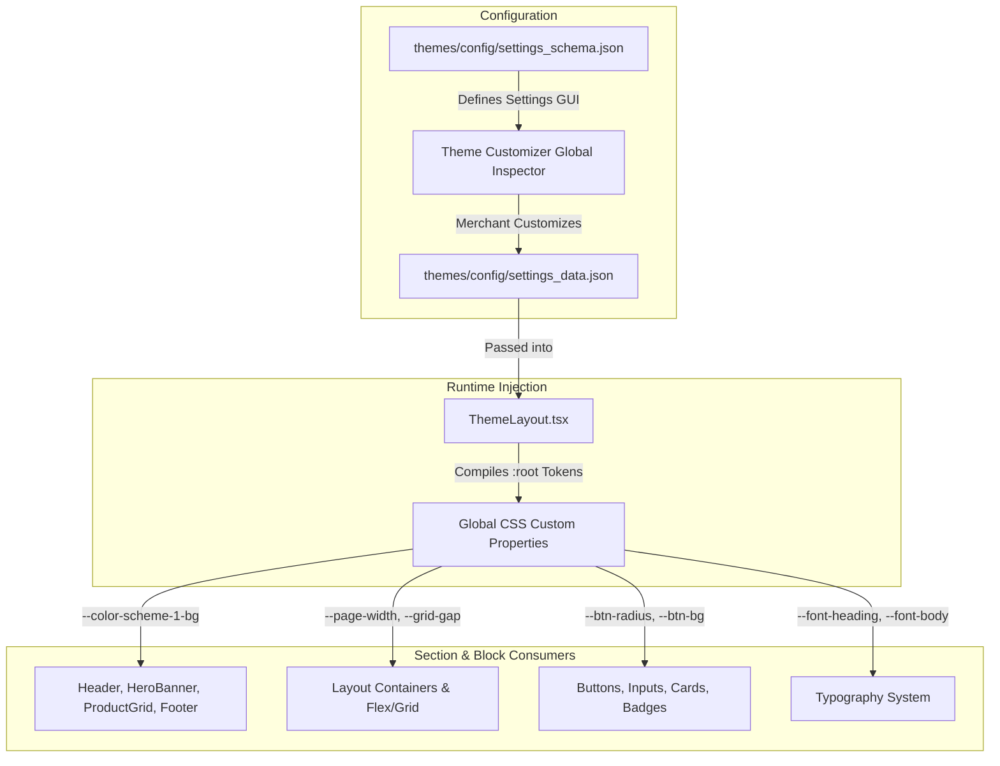

# Global Theme Settings Architecture & Design Tokens

> **A Comprehensive Specification for Store-Wide Theme Settings, Design Tokens, and CSS Custom Properties in Teras Sapa.**
> Modeled after **Shopify Dawn 2.0 / Horizon**, **Webflow Ecommerce**, **Framer**, and **Squarespace**.

---

## 1. Overview & Architectural Principles

Global theme settings control store-wide branding, design tokens, typography, layout dimensions, interactive UI components, cart behaviors, and social links.

In Teras Sapa's React architecture:

1. **`themes/config/settings_schema.json`** defines the editable form categories and input controls displayed in the Theme Customizer's global settings inspector.
2. **`themes/config/settings_data.json`** stores the active merchant values.
3. **`themes/layout/ThemeLayout.tsx`** reads `settings_data.json` and injects dynamic CSS custom properties (`var(--token)`) into `:root`.
4. **All Sections & Blocks** consume these CSS variables directly via Emotion styled components, ensuring a cohesive, store-wide design system with zero hardcoded values.



---

## 2. The 13 Global Settings Categories

```
Global Theme Settings Categories
├── 1. Theme Info & Metadata         (Theme name, version, author, documentation links)
├── 2. Logo & Brand Identity        (Desktop/Mobile logos, Favicon, Store name, Widths)
├── 3. Colors & Color Schemes       (5 Multi-role Color Schemes + Semantic status colors)
├── 4. Typography System            (Heading/Body fonts, Scale factors, Line heights, Text transforms)
├── 5. Layout & Grid Dimensions     (Max page width, Desktop/Mobile screen gutters, Grid gaps, Section margins)
├── 6. Buttons & Interactive CTAs   (Corner radius, Border thickness, Elevation shadow, Hover effects)
├── 7. Inputs & Form Controls       (Input radius, Border thickness, Focus rings)
├── 8. Product & Collection Cards   (Card style, Border radius, Shadow, Image padding, Hover image swap, Badges)
├── 9. Badges & Labels              (Sale, Sold Out, New, Corner shape: pill/rounded/square, Placement)
├── 10. Cart Drawer & Checkout      (Cart type: drawer/page/popup, Free shipping progress bar goal, Order notes)
├── 11. Predictive Search & Modals  (Live search toggle, Suggestions limit, Show price/vendor)
├── 12. Micro-Interactions & Motion (Reveal on scroll, Image zoom on hover, Smooth transitions)
└── 13. Social Media & Meta         (Social profile URLs, Open in new tab)
```

---

## 3. Comprehensive Settings Taxonomy

### 1. Logo & Brand Identity

| Setting ID          | Type           | Label                        | Options / Range                    | Default                      |
| :------------------ | :------------- | :--------------------------- | :--------------------------------- | :--------------------------- |
| `logo`              | `image_picker` | Desktop Logo Image           | `.png`, `.svg`, `.webp`            | `""`                         |
| `logo_mobile`       | `image_picker` | Mobile Logo Image (Optional) | `.png`, `.svg`, `.webp`            | `""`                         |
| `logo_width`        | `range`        | Desktop Logo Width           | `50px - 350px` (step 10)           | `140px`                      |
| `logo_width_mobile` | `range`        | Mobile Logo Width            | `30px - 200px` (step 5)            | `100px`                      |
| `favicon`           | `image_picker` | Favicon                      | 32x32px or 512x512px `.png`/`.ico` | `""`                         |
| `shop_name`         | `text`         | Store Name Fallback          | Text string                        | `"Teras Sapa Store"`            |
| `shop_tagline`      | `text`         | Brand Slogan                 | Text string                        | `"Modern Headless Commerce"` |

---

### 2. Multi-Role Color Schemes (Tokens)

Teras Sapa implements a **5-Scheme Color Matrix** where sections can dynamically switch between palettes:

#### Color Scheme 1: Primary Light (Default Body)

- `color_scheme_1_bg`: `#FFFFFF`
- `color_scheme_1_text`: `#121212`
- `color_scheme_1_heading`: `#121212`
- `color_scheme_1_accent`: `#000000` (Primary button solid background)
- `color_scheme_1_accent_text`: `#FFFFFF` (Primary button label)
- `color_scheme_1_border`: `#E5E7EB` (Subtle dividers)

#### Color Scheme 2: Soft Neutral (Cards & Secondary Sections)

- `color_scheme_2_bg`: `#F9FAFB`
- `color_scheme_2_text`: `#1F2937`
- `color_scheme_2_heading`: `#111827`
- `color_scheme_2_accent`: `#111827`
- `color_scheme_2_accent_text`: `#FFFFFF`
- `color_scheme_2_border`: `#E5E7EB`

#### Color Scheme 3: Dark Contrast (Footers, Dark Heroes & Announcements)

- `color_scheme_3_bg`: `#0F172A`
- `color_scheme_3_text`: `#E2E8F0`
- `color_scheme_3_heading`: `#F8FAFC`
- `color_scheme_3_accent`: `#3B82F6`
- `color_scheme_3_accent_text`: `#FFFFFF`
- `color_scheme_3_border`: `#1E293B`

#### Color Scheme 4: Brand Accent (Promotions & Highlights)

- `color_scheme_4_bg`: `#F0FDF4`
- `color_scheme_4_text`: `#14532D`
- `color_scheme_4_heading`: `#14532D`
- `color_scheme_4_accent`: `#16A34A`
- `color_scheme_4_accent_text`: `#FFFFFF`
- `color_scheme_4_border`: `#DCFCE7`

#### Color Scheme 5: Pure Midnight / Inverse

- `color_scheme_5_bg`: `#000000`
- `color_scheme_5_text`: `#F3F4F6`
- `color_scheme_5_heading`: `#FFFFFF`
- `color_scheme_5_accent`: `#FFFFFF`
- `color_scheme_5_accent_text`: `#000000`
- `color_scheme_5_border`: `#27272A`

#### Semantic Status Tokens:

- `color_success`: `#16A34A` (In stock, order confirmed)
- `color_warning`: `#F59E0B` (Low stock, caution)
- `color_error`: `#DC2626` (Sold out, validation error)
- `color_info`: `#2563EB` (Informational messages)

---

### 3. Typography System

| Setting ID               | Type     | Label                     | Options / Range                                                                    | Default               |
| :----------------------- | :------- | :------------------------ | :--------------------------------------------------------------------------------- | :-------------------- |
| `font_heading`           | `select` | Heading Font Family       | Inter, Roboto, Playfair Display, Outfit, Plus Jakarta Sans, Syne, Instrument Serif | `'Inter, sans-serif'` |
| `font_heading_weight`    | `select` | Heading Font Weight       | 400, 500, 600, 700, 800                                                            | `'700'`               |
| `heading_scale`          | `range`  | Heading Size Scale Factor | `80% - 140%` (step 5)                                                              | `100%`                |
| `heading_letter_spacing` | `range`  | Heading Letter Spacing    | `-1px - 4px` (step 0.5)                                                            | `0px`                 |
| `heading_text_transform` | `select` | Heading Text Transform    | `none`, `uppercase`, `capitalize`                                                  | `'none'`              |
| `font_body`              | `select` | Body Font Family          | Inter, Roboto, Open Sans, Plus Jakarta Sans                                        | `'Inter, sans-serif'` |
| `font_body_weight`       | `select` | Body Font Weight          | 400, 500                                                                           | `'400'`               |
| `font_body_base_size`    | `range`  | Base Body Size            | `13px - 18px` (step 1)                                                             | `15px`                |
| `font_body_line_height`  | `range`  | Body Line Height          | `1.3 - 2.0` (step 0.05)                                                            | `1.6`                 |

---

### 4. Layout & Grid Dimensions

| Setting ID              | Type    | Label                          | Range                       | Default  |
| :---------------------- | :------ | :----------------------------- | :-------------------------- | :------- |
| `page_width`            | `range` | Maximum Page Width             | `1000px - 1800px` (step 20) | `1280px` |
| `gutter_desktop`        | `range` | Desktop Screen Gutter          | `16px - 80px` (step 4)      | `32px`   |
| `gutter_mobile`         | `range` | Mobile Screen Gutter           | `12px - 32px` (step 2)      | `16px`   |
| `grid_gap_horizontal`   | `range` | Grid Column Gap                | `12px - 48px` (step 4)      | `24px`   |
| `grid_gap_vertical`     | `range` | Grid Row Gap                   | `12px - 64px` (step 4)      | `32px`   |
| `section_space_desktop` | `range` | Desktop Space Between Sections | `20px - 120px` (step 8)     | `64px`   |
| `section_space_mobile`  | `range` | Mobile Space Between Sections  | `16px - 80px` (step 4)      | `36px`   |

---

### 5. Buttons & Interactive Controls

| Setting ID              | Type     | Label                     | Options / Range                       | Default    |
| :---------------------- | :------- | :------------------------ | :------------------------------------ | :--------- |
| `button_border_radius`  | `range`  | Button Corner Radius      | `0px - 32px` (or `9999px` for Pill)   | `8px`      |
| `button_border_width`   | `range`  | Button Border Thickness   | `0px - 3px` (step 1)                  | `1px`      |
| `button_shadow`         | `select` | Button Shadow / Elevation | `none`, `subtle`, `medium`, `glow`    | `'subtle'` |
| `button_text_transform` | `select` | Button Text Transform     | `none`, `uppercase`, `capitalize`     | `'none'`   |
| `button_letter_spacing` | `range`  | Button Letter Spacing     | `0px - 3px` (step 0.5)                | `0.5px`    |
| `button_hover_effect`   | `select` | Hover Micro-Interaction   | `none`, `lift`, `scale`, `brightness` | `'lift'`   |

---

### 6. Product & Collection Cards

| Setting ID             | Type       | Label                      | Options / Range                                        | Default           |
| :--------------------- | :--------- | :------------------------- | :----------------------------------------------------- | :---------------- |
| `card_style`           | `select`   | Card Style                 | `standard` (flush), `card` (boxed container)           | `'standard'`      |
| `card_corner_radius`   | `range`    | Card Corner Radius         | `0px - 24px` (step 2)                                  | `12px`            |
| `card_border_width`    | `range`    | Card Border Thickness      | `0px - 2px` (step 1)                                   | `1px`             |
| `card_shadow`          | `select`   | Card Shadow Elevation      | `none`, `sm`, `md`, `lg`                               | `'sm'`            |
| `card_image_padding`   | `range`    | Internal Image Gutter      | `0px - 20px` (step 2)                                  | `0px`             |
| `card_text_alignment`  | `select`   | Content Text Alignment     | `left`, `center`, `right`                              | `'left'`          |
| `card_secondary_image` | `checkbox` | Show Second Image on Hover | `boolean`                                              | `true`            |
| `card_show_vendor`     | `checkbox` | Show Brand / Vendor        | `boolean`                                              | `false`           |
| `card_show_rating`     | `checkbox` | Show Review Star Ratings   | `boolean`                                              | `true`            |
| `card_quick_add`       | `select`   | Quick Add to Cart Button   | `none`, `hover_overlay`, `always_visible`, `icon_pill` | `'hover_overlay'` |

---

### 7. Badges & Labels

| Setting ID              | Type     | Label                   | Options / Range                                  | Default      |
| :---------------------- | :------- | :---------------------- | :----------------------------------------------- | :----------- |
| `badge_position`        | `select` | Position on Cards       | `top-left`, `top-right`, `bottom-left`           | `'top-left'` |
| `badge_shape`           | `select` | Corner Shape            | `square` (0px), `rounded` (4px), `pill` (9999px) | `'pill'`     |
| `badge_sale_scheme`     | `select` | Sale Badge Color Scheme | `scheme-1`, `scheme-2`, `scheme-3`, `scheme-4`   | `'scheme-3'` |
| `badge_sale_text`       | `text`   | Sale Badge Label        | Text                                             | `"Sale"`     |
| `badge_sold_out_scheme` | `select` | Sold Out Badge Scheme   | `scheme-1`, `scheme-2`, `scheme-5`               | `'scheme-2'` |
| `badge_sold_out_text`   | `text`   | Sold Out Badge Label    | Text                                             | `"Sold Out"` |

---

### 8. Cart Drawer & Checkout

| Setting ID                 | Type       | Label                                     | Options / Range                                 | Default    |
| :------------------------- | :--------- | :---------------------------------------- | :---------------------------------------------- | :--------- |
| `cart_type`                | `select`   | Cart Experience                           | `drawer` (slide-out), `page` (`/cart`), `popup` | `'drawer'` |
| `enable_free_shipping_bar` | `checkbox` | Enable Free Shipping Bar                  | `boolean`                                       | `true`     |
| `free_shipping_threshold`  | `number`   | Free Shipping Goal Amount ($)             | `number`                                        | `75`       |
| `cart_enable_notes`        | `checkbox` | Enable Order Notes / Special Instructions | `boolean`                                       | `true`     |
| `cart_show_upsells`        | `checkbox` | Show Recommended Upsells in Drawer        | `boolean`                                       | `true`     |

---

### 9. Motion & Micro-Interactions

| Setting ID                    | Type       | Label                      | Options / Range         | Default  |
| :---------------------------- | :--------- | :------------------------- | :---------------------- | :------- |
| `animations_reveal_on_scroll` | `checkbox` | Reveal Sections on Scroll  | `boolean`               | `true`   |
| `animations_hover_zoom`       | `checkbox` | Zoom Media Images on Hover | `boolean`               | `true`   |
| `animations_page_transition`  | `select`   | Page Navigation Transition | `none`, `fade`, `slide` | `'fade'` |

---

## 4. CSS Custom Properties (:root Mapping)

When `ThemeLayout.tsx` renders, it injects the following CSS variables into `:root`:

```css
:root {
  /* Layout & Viewport */
  --page-width: 1280px;
  --gutter-desktop: 32px;
  --gutter-mobile: 16px;
  --grid-gap-horizontal: 24px;
  --grid-gap-vertical: 32px;
  --section-space-desktop: 64px;
  --section-space-mobile: 36px;

  /* Typography */
  --font-heading: 'Inter', sans-serif;
  --font-heading-weight: 700;
  --heading-scale: 1;
  --heading-letter-spacing: 0px;
  --heading-text-transform: none;
  --font-body: 'Inter', sans-serif;
  --font-body-weight: 400;
  --font-body-size: 15px;
  --font-body-line-height: 1.6;

  /* Interactive UI & Buttons */
  --button-radius: 8px;
  --button-border-width: 1px;
  --button-letter-spacing: 0.5px;
  --button-text-transform: none;

  /* Cards */
  --card-radius: 12px;
  --card-border-width: 1px;
  --card-image-padding: 0px;

  /* Badges */
  --badge-radius: 9999px;

  /* Color Scheme 1 (Primary Light) */
  --color-scheme-1-bg: #ffffff;
  --color-scheme-1-text: #121212;
  --color-scheme-1-heading: #121212;
  --color-scheme-1-accent: #000000;
  --color-scheme-1-accent-text: #ffffff;
  --color-scheme-1-border: #e5e7eb;

  /* Color Scheme 2 (Soft Neutral) */
  --color-scheme-2-bg: #f9fafb;
  --color-scheme-2-text: #1f2937;
  --color-scheme-2-heading: #111827;
  --color-scheme-2-accent: #111827;
  --color-scheme-2-accent-text: #ffffff;
  --color-scheme-2-border: #e5e7eb;

  /* Color Scheme 3 (Dark Contrast) */
  --color-scheme-3-bg: #0f172a;
  --color-scheme-3-text: #e2e8f0;
  --color-scheme-3-heading: #f8fafc;
  --color-scheme-3-accent: #3b82f6;
  --color-scheme-3-accent-text: #ffffff;
  --color-scheme-3-border: #1e293b;

  /* Color Scheme 4 (Brand Accent) */
  --color-scheme-4-bg: #f0fdf4;
  --color-scheme-4-text: #14532d;
  --color-scheme-4-heading: #14532d;
  --color-scheme-4-accent: #16a34a;
  --color-scheme-4-accent-text: #ffffff;
  --color-scheme-4-border: #dcfce7;

  /* Color Scheme 5 (Pure Midnight) */
  --color-scheme-5-bg: #000000;
  --color-scheme-5-text: #f3f4f6;
  --color-scheme-5-heading: #ffffff;
  --color-scheme-5-accent: #ffffff;
  --color-scheme-5-accent-text: #000000;
  --color-scheme-5-border: #27272a;

  /* Semantic Status Colors */
  --color-success: #16a34a;
  --color-warning: #f59e0b;
  --color-error: #dc2626;
  --color-info: #2563eb;
}
```
