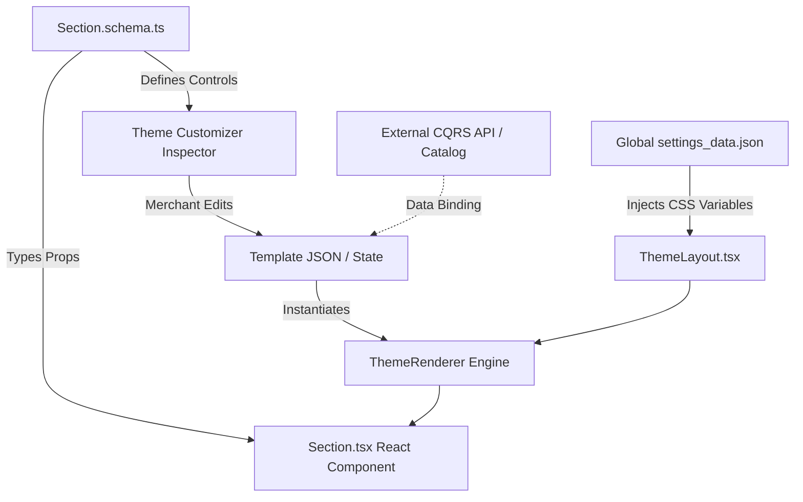

# Theme Section & Block Schema Architecture

> **A Comprehensive Specification for Schema-Driven, Type-Safe React Theme Components in Teras Sapa.**
> Inspired by **Shopify Liquid & Dawn Architecture**, **Builder.io**, **Storyblok**, and **Sanity**.

---

## 1. Overview & Architectural Principles

In Teras Sapa's headless architecture, themes are built using **React, TypeScript, and Emotion**. The visual customizer operates as a structured content management system and CSS compiler rather than a raw HTML editor.

The **Section Schema** acts as the single source of truth connecting three distinct layers:

1. **The Merchant Customizer:** Automatically generates intuitive visual inspector controls (inputs, dropdowns, pickers, color pickers) in the editor sidebar.
2. **The Component Contract:** Defines strict TypeScript interfaces passed as props (`SectionComponentProps<T>`) to the React component.
3. **The Data Storage Layer:** Serializes section instances, child blocks, and active settings into pure JSON template files (`themes/templates/*.json`).



---

## 2. Core Units: Sections vs. Blocks vs. Snippets

| Unit              | Directory                       |                  Has Schema?                  |          Customizer Visible?           | Purpose                                                                                                      |
| :---------------- | :------------------------------ | :-------------------------------------------: | :------------------------------------: | :----------------------------------------------------------------------------------------------------------- |
| **Section**       | `themes/sections/[name]/`       |         **YES** (`[Name].schema.ts`)          |     **YES** (Layer tree & canvas)      | High-level modular layout components (e.g. `Header`, `HeroBanner`, `FeaturedCollection`, `Footer`).          |
| **Block**         | `themes/blocks/[name]/`         |         **YES** (`[Name].schema.ts`)          | **YES** (Nested inside parent section) | Reorderable, addable child components living within a section (e.g. `Announcement`, `Slide`, `ButtonBlock`). |
| **Snippet**       | `themes/snippets/[name]/`       |         **NO** (Strictly prohibited)          |    **NO** (Internal developer-only)    | Reusable UI rendering helpers (e.g. `Price`, `Badge`, `RatingStars`, `QuantityInput`).                       |
| **Master Layout** | `themes/layout/ThemeLayout.tsx` | Global schema (`config/settings_schema.json`) |        **YES** (Theme settings)        | Master viewport wrapper injecting global CSS tokens (`--color-bg`, `--font-heading`) into `:root`.           |

---

## 3. Exhaustive Input & Setting Types Taxonomy

The schema engine supports **6 distinct tiers** of setting input types:

```
Setting Types Taxonomy
├── Tier 1: Primitives & Basic Controls   (text, textarea, number, range, checkbox, switch, select, radio, button_group)
├── Tier 2: Rich Media & Assets          (image_picker, video, video_url, icon_picker, file_picker)
├── Tier 3: Rich Content & Typography    (inline_richtext, richtext, html, liquid)
├── Tier 4: Design System & Styling      (color, color_scheme, color_background, font_picker, spacing, alignment, aspect_ratio, border_radius, shadow)
├── Tier 5: Commerce & Resource Pickers  (product, product_list, collection, collection_list, page, article, blog, menu, url, data_binding)
└── Tier 6: UI Organization & Repeater   (header, paragraph, divider, group, tabs, repeater)
```

---

### Tier 1: Primitives & Basic Form Controls

| Type           | Description                                                                  | Key Properties                                        | Runtime Output Type |
| :------------- | :--------------------------------------------------------------------------- | :---------------------------------------------------- | :------------------ |
| `text`         | Single-line string input                                                     | `placeholder`, `maxlength`                            | `string`            |
| `textarea`     | Multi-line plain text area                                                   | `rows`, `placeholder`, `maxlength`                    | `string`            |
| `number`       | Numeric stepper / input                                                      | `min`, `max`, `step`, `placeholder`                   | `number`            |
| `range`        | Visual slider with numeric feedback                                          | `min`, `max`, `step`, `unit` (`px`, `rem`, `%`, `vh`) | `number`            |
| `checkbox`     | Standard boolean checkbox                                                    | `label`, `info`                                       | `boolean`           |
| `switch`       | Modern visual toggle switch                                                  | `label`, `info`                                       | `boolean`           |
| `select`       | Dropdown selection menu                                                      | `options: Array<{ label, value, group? }>`            | `string \| number`  |
| `radio`        | Radio button list                                                            | `options: Array<{ label, value }>`                    | `string \| number`  |
| `button_group` | Visual pill / segmented button group (ideal for alignments, device previews) | `options: Array<{ label, value, icon? }>`             | `string`            |

---

### Tier 2: Rich Media & Assets

| Type           | Description                                                             | Key Properties                                    | Runtime Output Type                                                                                                     |
| :------------- | :---------------------------------------------------------------------- | :------------------------------------------------ | :---------------------------------------------------------------------------------------------------------------------- |
| `image_picker` | Image upload and media library selector with focal point & crop support | `allowed_types`, `dimensions`, `alt_editable`     | `{ id: string, url: string, altText?: string, width?: number, height?: number, focalPoint?: { x: number, y: number } }` |
| `video`        | Direct hosted video (MP4/WebM) from media library                       | `allowed_types`, `enable_autoplay`, `enable_loop` | `{ id: string, url: string, posterUrl?: string, duration?: number }`                                                    |
| `video_url`    | External video embed (YouTube / Vimeo / Loom / TikTok)                  | `accept: ['youtube', 'vimeo']`                    | `{ url: string, provider: 'youtube' \| 'vimeo', id: string }`                                                           |
| `icon_picker`  | Curated icon library selector (Lucide, Tabler, Phosphor)                | `library: 'lucide'`, `categories`                 | `string` (e.g. `'lucide:truck'`)                                                                                        |
| `file_picker`  | Generic downloadable document (PDF, ZIP, CSV)                           | `accept: ['.pdf', '.zip']`                        | `{ id: string, url: string, filename: string, sizeBytes: number }`                                                      |

---

### Tier 3: Rich Content & Typography

| Type              | Description                                                                                                           | Key Properties                                                    | Runtime Output Type        |
| :---------------- | :-------------------------------------------------------------------------------------------------------------------- | :---------------------------------------------------------------- | :------------------------- |
| `inline_richtext` | Lightweight rich text for titles and subtitles allowing `<b>`, `<i>`, and inline `<a>` without wrapping in `<p>` tags | `allowed_tags: ['b', 'i', 'a', 'span']`                           | `string` (HTML string)     |
| `richtext`        | Full WYSIWYG editor (Headings H1-H4, Paragraphs, Lists, Blockquotes, Links, Tables)                                   | `toolbar: ['bold', 'italic', 'heading', 'link', 'list', 'align']` | `string` (HTML / Markdown) |
| `html` / `liquid` | Raw HTML/Liquid snippet for developer embeds or custom scripts                                                        | `syntax: 'html' \| 'liquid' \| 'css'`                             | `string`                   |

---

### Tier 4: Design System & Styling Controls

| Type                    | Description                                                                                      | Key Properties                                                     | Runtime Output Type                                                          |
| :---------------------- | :----------------------------------------------------------------------------------------------- | :----------------------------------------------------------------- | :--------------------------------------------------------------------------- |
| `color`                 | Direct Hex / RGBA color picker with alpha channel slider                                         | `allow_alpha: boolean`, `swatches?: string[]`                      | `string` (e.g. `'#FF0055'`)                                                  |
| `color_scheme`          | Binds to pre-configured theme global schemes (Scheme 1: Light, Scheme 2: Dark, Scheme 3: Accent) | `default: 'scheme-1'`                                              | `string` (e.g. `'scheme-1'`)                                                 |
| `color_background`      | Advanced background picker supporting solid colors, linear gradients, and radial gradients       | `allow_gradient: boolean`                                          | `string` (e.g. `'linear-gradient(90deg, #111, #444)'`)                       |
| `font_picker`           | Typography selector mapping to store Google Fonts or custom web fonts                            | `subsets`, `weights`                                               | `{ family: string, weight: number, style: 'normal' \| 'italic' }`            |
| `spacing` / `box_model` | 4-side spacing selector (Top, Right, Bottom, Left) with unit selection and link/unlink toggle    | `unit: 'px' \| 'rem'`, `sides: ['top', 'right', 'bottom', 'left']` | `{ top: number, right: number, bottom: number, left: number, unit: string }` |
| `alignment`             | Visual 2D spatial alignment matrix                                                               | `mode: 'text' \| 'flex_2d' \| 'grid'`                              | `'left' \| 'center' \| 'right'` or `'top-left' \| 'middle-center' \| ...`    |
| `aspect_ratio`          | Preset or custom image/card aspect ratios                                                        | `options: ['auto', '1/1', '4/3', '16/9', '3/4', '2/3', 'custom']`  | `string`                                                                     |
| `border_radius`         | Corner radius preset or pixel slider                                                             | `presets: ['none', 'sm', 'md', 'lg', 'full']`                      | `string \| number`                                                           |
| `shadow`                | Elevation / box-shadow preset selector                                                           | `presets: ['none', 'sm', 'md', 'lg', 'xl', '2xl', 'inner']`        | `string`                                                                     |

---

### Tier 5: Commerce & Resource Pickers (Data Binding)

| Type                 | Description                                                                           | Key Properties                                        | Runtime Output Type                                             |
| :------------------- | :------------------------------------------------------------------------------------ | :---------------------------------------------------- | :-------------------------------------------------------------- |
| `product`            | Single product selector (searches catalog by handle/ID)                               | `filterable: boolean`                                 | `string` (Product ID or handle)                                 |
| `product_list`       | Multi-product selector (curated lists or manual order)                                | `limit?: number` (e.g. max 12)                        | `string[]` (Array of product IDs)                               |
| `collection`         | Single category / collection picker                                                   | `filterable: boolean`                                 | `string` (Collection ID or slug)                                |
| `collection_list`    | Multi-collection selector (e.g. Collection Carousel)                                  | `limit?: number`                                      | `string[]`                                                      |
| `page`               | Internal static / custom page selector                                                | `filter_by_template?`                                 | `string` (Page slug/ID)                                         |
| `article` / `blog`   | Editorial blog / article selector                                                     | `blog_handle?`                                        | `string` (Article slug/ID)                                      |
| `menu` / `link_list` | Navigation menu selector (Header menus, Footer columns)                               | `default: 'main-menu'`                                | `string` (Menu handle)                                          |
| `url`                | Omnibox link picker supporting internal resources and external URLs + target `_blank` | `allow_external: boolean`, `allow_anchor: boolean`    | `{ url: string, target?: '_self' \| '_blank', title?: string }` |
| `data_binding`       | Dynamic CQRS query / variable placeholder binding (`{{ product.title }}`)             | `allowed_contexts: ['product', 'collection', 'cart']` | `string`                                                        |

---

### Tier 6: UI Structure & Inspector Organization

| Type                  | Description                                                                     | Key Properties                                                             |
| :-------------------- | :------------------------------------------------------------------------------ | :------------------------------------------------------------------------- |
| `header`              | Visual section header / category divider in the inspector sidebar               | `content: string`, `info?: string`                                         |
| `paragraph`           | Informational helper / guideline box with Markdown/links support                | `content: string`                                                          |
| `divider`             | Subtle visual horizontal line                                                   | `none`                                                                     |
| `group` / `accordion` | Collapsible accordion containing grouped sub-settings                           | `label: string`, `default_open?: boolean`, `settings: SettingDefinition[]` |
| `tabs`                | Tabbed navigation for separating settings (`Content`, `Style`, `Advanced`)      | `tabs: Array<{ label: string, settings: SettingDefinition[] }>`            |
| `repeater`            | Inline repeating array of structured fields (lightweight alternative to blocks) | `min_items`, `max_items`, `item_label`, `fields: SettingDefinition[]`      |

---

## 4. Advanced Schema Features

### A. Conditional Visibility (`visible_if`)

Allows settings to dynamically show or hide based on other settings:

```typescript
// Simple condition
{
  type: 'checkbox',
  id: 'show_button',
  label: 'Show CTA button',
  default: true,
},
{
  type: 'text',
  id: 'button_label',
  label: 'Button Label',
  default: 'Shop Now',
  visible_if: {
    setting: 'show_button',
    operator: '==',
    value: true,
  },
}

// Compound condition (AND / OR)
{
  type: 'range',
  id: 'video_start_time',
  label: 'Start time (seconds)',
  min: 0,
  max: 300,
  default: 0,
  visible_if: {
    operator: 'and',
    conditions: [
      { setting: 'media_type', operator: '==', value: 'video' },
      { setting: 'enable_custom_start', operator: '==', value: true },
    ],
  },
}
```

---

### B. Responsive Breakpoint Overrides (`responsive: true`)

Allows merchants to configure desktop, tablet, and mobile values independently:

```typescript
{
  type: 'range',
  id: 'columns_count',
  label: 'Grid Columns',
  min: 1,
  max: 6,
  step: 1,
  default: 4,
  responsive: true, // Enables Desktop / Tablet / Mobile tabs in inspector
}
```

Runtime resolved value:

```typescript
{
  desktop: 4,
  tablet: 2,
  mobile: 1
}
```

---

### C. Inline Repeaters (`type: 'repeater'`)

Used when a section requires simple repeating items (such as feature bullet points, social links, or accordion FAQs) without declaring separate block files:

```typescript
{
  type: 'repeater',
  id: 'perks',
  label: 'Store Perks',
  min_items: 1,
  max_items: 4,
  item_label: '{{ title }}',
  default: [
    { icon: 'lucide:truck', title: 'Free Global Shipping', subtitle: 'Orders over $75' },
    { icon: 'lucide:shield-check', title: 'Secure Payment', subtitle: 'Encrypted transactions' },
  ],
  fields: [
    { type: 'icon_picker', id: 'icon', label: 'Perk Icon', default: 'lucide:sparkles' },
    { type: 'text', id: 'title', label: 'Perk Title' },
    { type: 'text', id: 'subtitle', label: 'Perk Subtitle' },
  ],
}
```

---

## 5. TypeScript Specification (`themes/types/theme.ts`)

```typescript
export type SettingType =
  // Tier 1: Primitives
  | 'text'
  | 'textarea'
  | 'number'
  | 'range'
  | 'checkbox'
  | 'switch'
  | 'select'
  | 'radio'
  | 'button_group'
  // Tier 2: Media
  | 'image_picker'
  | 'video'
  | 'video_url'
  | 'icon_picker'
  | 'file_picker'
  // Tier 3: Content
  | 'inline_richtext'
  | 'richtext'
  | 'html'
  | 'liquid'
  // Tier 4: Styling
  | 'color'
  | 'color_scheme'
  | 'color_background'
  | 'font_picker'
  | 'spacing'
  | 'alignment'
  | 'aspect_ratio'
  | 'border_radius'
  | 'shadow'
  // Tier 5: Commerce Pickers
  | 'product'
  | 'product_list'
  | 'collection'
  | 'collection_list'
  | 'page'
  | 'article'
  | 'blog'
  | 'menu'
  | 'url'
  | 'data_binding'
  // Tier 6: UI & Organization
  | 'header'
  | 'paragraph'
  | 'divider'
  | 'group'
  | 'tabs'
  | 'repeater'

export type ConditionOperator =
  '==' | '!=' | '>' | '<' | '>=' | '<=' | 'in' | 'contains'

export interface SimpleCondition {
  setting: string
  operator: ConditionOperator
  value: any
}

export interface CompoundCondition {
  operator: 'and' | 'or'
  conditions: (SimpleCondition | CompoundCondition)[]
}

export type VisibilityRule = SimpleCondition | CompoundCondition

export interface SettingOption<T = string | number> {
  label: string
  value: T
  icon?: string
  group?: string
}

export interface SettingDefinition {
  id?: string
  type: SettingType
  label?: string
  content?: string
  info?: string
  default?: any
  placeholder?: string
  min?: number
  max?: number
  step?: number
  unit?: string
  options?: SettingOption[]
  allowed_types?: string[]
  accept?: string | string[]
  fields?: SettingDefinition[]
  min_items?: number
  max_items?: number
  item_label?: string
  responsive?: boolean
  visible_if?: VisibilityRule
}

export interface BlockSchema {
  type: string
  name: string
  description?: string
  icon?: string
  limit?: number
  settings: SettingDefinition[]
}

export interface SectionPreset {
  name: string
  category?: string
  settings?: Record<string, any>
  blocks?: Array<{
    type: string
    settings?: Record<string, any>
  }>
}

export interface SectionSchema {
  type: string
  name: string
  category?:
    | 'Header'
    | 'Hero'
    | 'Product'
    | 'Collection'
    | 'Promotional'
    | 'Editorial'
    | 'Layout'
    | 'Footer'
  description?: string
  icon?: string
  tag?: 'header' | 'footer' | 'section' | 'article' | 'aside' | 'div' | 'nav'
  class?: string
  limit?: number
  enabled_on?: { templates?: string[] }
  disabled_on?: { templates?: string[] }
  settings: SettingDefinition[]
  blocks?: BlockSchema[]
  max_blocks?: number
  presets?: SectionPreset[]
}
```

---

## 6. Real-World Section Schema Examples

### A. `HeroBanner.schema.ts`

```typescript
import type { SectionSchema } from '../../types/theme'

export const HeroBannerSchema: SectionSchema = {
  type: 'hero_banner',
  name: 'Hero Banner',
  category: 'Hero',
  description:
    'Full-width or framed hero banner with background media, overlay, and CTAs.',
  tag: 'section',
  class: 'section-hero-banner',
  settings: [
    { type: 'header', content: 'Background Media' },
    {
      type: 'image_picker',
      id: 'background_image',
      label: 'Background Image',
      info: 'Recommended size: 1920x1080px for desktop.',
    },
    {
      type: 'video_url',
      id: 'video_url',
      label: 'Background Video (Optional)',
      accept: ['youtube', 'vimeo'],
    },
    {
      type: 'range',
      id: 'overlay_opacity',
      label: 'Dark Overlay Opacity',
      min: 0,
      max: 90,
      step: 5,
      unit: '%',
      default: 30,
    },
    { type: 'header', content: 'Content & Layout' },
    {
      type: 'inline_richtext',
      id: 'heading',
      label: 'Heading',
      default: 'Summer Collection <strong>2026</strong>',
    },
    {
      type: 'richtext',
      id: 'subheading',
      label: 'Subheading',
      default:
        '<p>Discover sustainable, high-performance apparel crafted for modern living.</p>',
    },
    {
      type: 'select',
      id: 'content_alignment',
      label: 'Desktop Content Alignment',
      default: 'middle-center',
      options: [
        { label: 'Top Left', value: 'top-left' },
        { label: 'Middle Center', value: 'middle-center' },
        { label: 'Bottom Center', value: 'bottom-center' },
      ],
    },
    {
      type: 'color_scheme',
      id: 'color_scheme',
      label: 'Color Scheme',
      default: 'scheme-2',
    },
    { type: 'header', content: 'Spacing' },
    {
      type: 'range',
      id: 'padding_top',
      label: 'Top Padding',
      min: 0,
      max: 100,
      step: 4,
      unit: 'px',
      default: 0,
    },
    {
      type: 'range',
      id: 'padding_bottom',
      label: 'Bottom Padding',
      min: 0,
      max: 100,
      step: 4,
      unit: 'px',
      default: 0,
    },
  ],
  blocks: [
    {
      type: 'button',
      name: 'CTA Button',
      limit: 2,
      settings: [
        {
          type: 'text',
          id: 'button_label',
          label: 'Button Label',
          default: 'Shop Collection',
        },
        {
          type: 'url',
          id: 'button_link',
          label: 'Button Link',
          default: { url: '/collections/all' },
        },
        {
          type: 'select',
          id: 'button_style',
          label: 'Button Style',
          default: 'primary',
          options: [
            { label: 'Primary (Solid)', value: 'primary' },
            { label: 'Secondary (Outline)', value: 'secondary' },
          ],
        },
      ],
    },
  ],
  presets: [
    {
      name: 'Default Hero Banner',
      settings: {
        heading: 'Summer Collection <strong>2026</strong>',
        content_alignment: 'middle-center',
        overlay_opacity: 30,
        color_scheme: 'scheme-2',
      },
      blocks: [
        {
          type: 'button',
          settings: {
            button_label: 'Explore New Arrivals',
            button_style: 'primary',
          },
        },
      ],
    },
  ],
}
```

---

### B. `FeaturedCollection.schema.ts`

```typescript
import type { SectionSchema } from '../../types/theme'

export const FeaturedCollectionSchema: SectionSchema = {
  type: 'featured_collection',
  name: 'Featured Collection',
  category: 'Collection',
  description:
    'Display a dynamic curated grid or carousel of products from a selected collection.',
  tag: 'section',
  class: 'section-featured-collection',
  settings: [
    {
      type: 'inline_richtext',
      id: 'title',
      label: 'Heading',
      default: 'Featured Products',
    },
    {
      type: 'collection',
      id: 'collection',
      label: 'Select Collection',
      info: 'Pulls dynamic catalog products from your store database.',
    },
    {
      type: 'range',
      id: 'products_to_show',
      label: 'Maximum Products to Show',
      min: 2,
      max: 24,
      step: 2,
      default: 8,
    },
    {
      type: 'range',
      id: 'columns_desktop',
      label: 'Desktop Columns',
      min: 2,
      max: 6,
      step: 1,
      default: 4,
    },
    {
      type: 'select',
      id: 'columns_mobile',
      label: 'Mobile Layout',
      default: '2',
      options: [
        { label: '1 Column', value: '1' },
        { label: '2 Columns', value: '2' },
        { label: 'Swipeable Carousel', value: 'carousel' },
      ],
    },
    { type: 'header', content: 'Product Card Display' },
    {
      type: 'aspect_ratio',
      id: 'image_ratio',
      label: 'Product Image Ratio',
      default: '1/1',
      options: [
        { label: 'Square (1:1)', value: '1/1' },
        { label: 'Portrait (3:4)', value: '3/4' },
        { label: 'Adapt to Image', value: 'auto' },
      ],
    },
    {
      type: 'checkbox',
      id: 'show_secondary_image',
      label: 'Show Second Image on Hover',
      default: true,
    },
    {
      type: 'checkbox',
      id: 'enable_quick_add',
      label: 'Enable Quick Add to Cart Button',
      default: true,
    },
    {
      type: 'color_scheme',
      id: 'color_scheme',
      label: 'Color Scheme',
      default: 'scheme-1',
    },
  ],
  presets: [
    {
      name: 'Featured Collection Grid',
      settings: {
        title: 'Trending This Week',
        products_to_show: 8,
        columns_desktop: 4,
        columns_mobile: '2',
        show_secondary_image: true,
        enable_quick_add: true,
        color_scheme: 'scheme-1',
      },
    },
  ],
}
```

---

## 7. Template JSON Persistence Model

Merchant customizations made in the Theme Customizer are serialized into clean, pure JSON template files (`themes/templates/*.json`):

```json
{
  "name": "Homepage",
  "layout": "ThemeLayout",
  "sections": {
    "header_main": {
      "type": "header",
      "settings": {
        "logo_position": "middle-left",
        "sticky_header_type": "on-scroll-up",
        "color_scheme": "scheme-1"
      },
      "block_order": ["announcement_1"],
      "blocks": {
        "announcement_1": {
          "type": "announcement",
          "settings": {
            "text": "✨ Free worldwide shipping on orders over $75!",
            "text_alignment": "center",
            "color_scheme": "scheme-2"
          }
        }
      }
    },
    "hero_banner_1": {
      "type": "hero_banner",
      "settings": {
        "heading": "Summer Collection <strong>2026</strong>",
        "overlay_opacity": 30,
        "color_scheme": "scheme-2"
      },
      "block_order": ["btn_1"],
      "blocks": {
        "btn_1": {
          "type": "button",
          "settings": {
            "button_label": "Shop Now",
            "button_link": { "url": "/collections/all" },
            "button_style": "primary"
          }
        }
      }
    },
    "featured_collection_1": {
      "type": "featured_collection",
      "settings": {
        "title": "Trending Now",
        "collection": "col_summer_arrivals",
        "products_to_show": 8,
        "columns_desktop": 4,
        "enable_quick_add": true
      }
    }
  },
  "order": ["header_main", "hero_banner_1", "featured_collection_1"]
}
```

---

## 8. Benchmark Comparison

| Dimension                   |   Shopify Dawn (Liquid)    |       Builder.io       |        Storyblok         |        Teras Sapa (This Specification)        |
| :-------------------------- | :------------------------: | :--------------------: | :----------------------: | :----------------------------------------: |
| **Component Model**         |  Liquid + Web Components   |  React / Vue / Svelte  |  Vue / React Components  |       **Pure React (TSX) + Emotion**       |
| **Schema Definition**       | JSON inside `` |    JS Object in SDK    | Visual GUI + JSON export |  **Type-Safe `.schema.ts` (TypeScript)**   |
| **Color Schemes**           |   `color_scheme` tokens    |  Custom CSS variables  |      Plugin fields       |      **`:root` CSS Variable Tokens**       |
| **Gradients & Backgrounds** |     `color_background`     |    Gradient editor     |      Custom plugin       | **`color_background` (Solid + Gradients)** |
| **Inline Rich Text**        |     `inline_richtext`      | `richText` inline mode |         Markdown         |   **`inline_richtext` (No extra `<p>`)**   |
| **Catalog Pickers**         |   Native Liquid objects    |   REST integrations    |      Custom plugins      |      **Native CQRS Catalog Pickers**       |
| **Icon Picker**             | Third-party / Liquid icons |     Custom plugin      |          Plugin          |      **Native Curated Lucide Icons**       |
| **Conditional Controls**    |        `visible_if`        |   `showIf(options)`    |    Conditional bloks     |    **Declarative `visible_if` Engine**     |
| **Responsive Controls**     |        Range slider        |   Breakpoint Matrix    |  Per-field breakpoints   |       **`responsive: true` option**        |
| **Inline Repeaters**        |        Blocks only         |    `list` / `array`    |       Nested bloks       |    **Lightweight `repeater` + Blocks**     |
