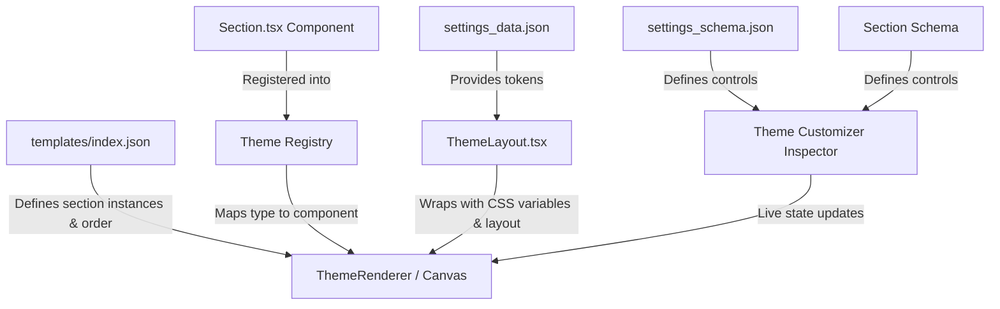

# React Theme & Template Engine Architecture

> **A modern, schema-driven theme infrastructure inspired by Shopify's Liquid Dawn architecture, powered natively by React, TypeScript, and Emotion.**

---

## 1. Overview & Philosophy

The **Teras Sapa Theme Engine** brings the modular, schema-driven architecture of Shopify Dawn to a modern React stack.

In traditional Shopify themes, developers write server-parsed `.liquid` files with embedded `` JSON blocks. In our React Theme Engine:

- **Sections & Blocks** are written as typed **React Components** (`.tsx`).
- **Schemas** are written as typed **JSON / TypeScript definitions** (`.schema.ts`).
- **Templates & Configurations** are saved as pure **JSON** (`templates/*.json`, `settings_data.json`).
- **The Theme Customizer** dynamically parses schemas to auto-generate visual inspector controls with **instant real-time hot re-rendering**.



---

## 2. Directory Structure

```text
themes/
├── config/
│   ├── settings_schema.json          # 🌐 Global theme settings schema (Colors, Logo, Typography)
│   └── settings_data.json            # ⚙️ Active global theme values
├── layout/
│   └── ThemeLayout.tsx               # 🖼️ Master layout (Translates layout/theme.liquid into React)
├── sections/
│   └── header/
│       ├── Header.tsx                # 🧩 Header section component
│       ├── Header.schema.ts          # 📜 Header section schema (settings, blocks, presets)
│       └── index.ts
├── blocks/
│   └── announcement/
│       ├── AnnouncementBlock.tsx     # 🧱 Announcement bar child block component
│       ├── AnnouncementBlock.schema.ts # 📜 Announcement block schema
│       └── index.ts
├── snippets/
│   ├── Price.tsx                     # ✂️ Reusable UI snippet (No schema, developer-facing)
│   └── index.ts
├── templates/
│   └── index.json                    # 📄 Page template (Translates templates/index.json)
├── registry.ts                       # 🗺️ Central Section & Block Registry
├── types/theme.ts                    # 🏷️ TypeScript definitions
└── index.ts                          # 📦 Public theme API
```

---

## 3. The 6 Core Layers

### Layer 1: Global Theme Settings (`config/`)

Global settings dictate store-wide branding, colors, typography, and layout rules.

1. **`config/settings_schema.json`**:
   Defines the editable global options in categories (Logo, Colors, Typography).
2. **`config/settings_data.json`**:
   Contains the active global values chosen by the merchant.

#### How It Works:

`ThemeLayout` reads `settings_data.json` and injects global CSS variables into the `:root` pseudo-class:

```css
:root {
  --color-bg: #ffffff;
  --color-text: #121212;
  --color-accent: #000000;
  --font-heading: 'Inter', sans-serif;
  --page-width: 1200px;
}
```

---

### Layer 2: Master Layout (`layout/`)

Equivalent to Shopify's `layout/theme.liquid`.

- **File:** `themes/layout/ThemeLayout.tsx`
- **Purpose:** Wraps all storefront pages with global CSS tokens, header groups, main content container (`children`), and footer groups.

```tsx
<ThemeLayout
  globalSettings={globalSettings}
  headerComponent={<HeaderGroup />}
  footerComponent={<FooterGroup />}
>
  {/* Equivalent to {{ content_for_layout }} */}
  {children}
</ThemeLayout>
```

---

### Layer 3: Sections & Blocks (`sections/`, `blocks/`)

The visual building blocks of the theme.

#### 1. Sections (`sections/header/`)

Sections are standalone, high-level page modules (e.g. `Header`, `HeroBanner`, `FeaturedCollection`). Each section consists of:

- **`Header.schema.ts`**: Defines the section's name, category, settings controls (select, range, checkbox, color), allowed child blocks, and default presets.
- **`Header.tsx`**: A pure React component receiving `settings`, `blocks`, and `blockOrder` via props:

```tsx
export interface HeaderSettings {
  logo_position?: 'middle-left' | 'top-left' | 'top-center'
  sticky_header_type?: 'none' | 'on-scroll-up' | 'always'
  show_line_separator?: boolean
  color_scheme?: string
  padding_top?: number
  padding_bottom?: number
  logo_text?: string
}

export const Header: React.FC<SectionComponentProps<HeaderSettings>> = ({
  settings,
  blocks = {},
  blockOrder = [],
}) => {
  return (
    <header>
      {/* 1. Render Child Blocks */}
      {blockOrder.map((blockId) => {
        const block = blocks[blockId]
        if (block?.type === 'announcement') {
          return (
            <AnnouncementBlock
              key={blockId}
              id={blockId}
              settings={block.settings}
            />
          )
        }
        return null
      })}

      {/* 2. Main Section UI */}
      <div>{settings.logo_text}</div>
    </header>
  )
}
```

#### 2. Blocks (`blocks/announcement/`)

Blocks are re-orderable, customizable elements that live inside a section (e.g. `Announcement`, `Slide`, `ProductTitle`, `BuyButton`).

- Each block has its own schema (`AnnouncementBlock.schema.ts`) and React component (`AnnouncementBlock.tsx`).

#### 3. Snippets (`snippets/`)

Snippets are **developer-facing, reusable UI components** (e.g. `Price`, `Badge`, `Icon`, `ProductCard`, `QuantitySelector`).

- **No Schema:** Snippets do NOT have a schema and are NOT displayed in the Theme Customizer.
- **Props-Driven:** Snippets receive data solely via standard React props passed by parent Sections, Blocks, or Layouts.
- **Purpose:** DRY code organization and reuse across multiple sections without duplicating layout logic.

---

### Layer 4: Page Templates (`templates/`)

Equivalent to Shopify's `templates/*.json` (e.g. `index.json`, `product.json`, `collection.json`).

Templates store **pure data**, with zero hardcoded presentation:

- Which sections are active.
- What order they render in (`order: ["header_main", "hero_1", "products_1"]`).
- Custom setting overrides for each section instance.
- Child block instances and their order (`block_order`).

#### Example `templates/index.json`:

```json
{
  "name": "Home Page",
  "layout": "theme",
  "sections": {
    "header_main": {
      "type": "header",
      "settings": {
        "logo_position": "middle-left",
        "sticky_header_type": "on-scroll-up",
        "color_scheme": "scheme-1",
        "padding_top": 20,
        "padding_bottom": 20,
        "logo_text": "Teras Sapa"
      },
      "block_order": ["announcement_1"],
      "blocks": {
        "announcement_1": {
          "type": "announcement",
          "settings": {
            "text": "✨ Summer Sale: Up to 50% off select items!",
            "link": "/collections/summer-sale",
            "color_scheme": "scheme-2"
          }
        }
      }
    }
  },
  "order": ["header_main"]
}
```

---

### Layer 5: Section & Block Registry (`registry.ts`)

A central registry that maps string identifiers (like `"header"`, `"announcement"`) to their React components and schema definitions.

```ts
export const SectionRegistry: Record<string, RegisteredSection> = {
  header: {
    Component: Header,
    schema: HeaderSchema,
  },
}

export const BlockRegistry: Record<string, RegisteredBlock> = {
  announcement: {
    Component: AnnouncementBlock,
    schema: AnnouncementBlockSchema,
  },
}
```

---

### Layer 6: Theme Customizer & Dynamic Form Inspector (`src/routes/_app.editor/`)

The interactive visual editor where merchants customize their theme is colocated under `src/routes/_app.editor/components/`:

1. **`DynamicFormInspector.tsx`**:
   Reads any `SettingDefinition[]` from a schema and dynamically renders the corresponding input control:
   - `text` / `url` $\rightarrow$ Text Input
   - `select` $\rightarrow$ Dropdown Select
   - `range` / `number` $\rightarrow$ Slider with min/max/step/unit
   - `checkbox` $\rightarrow$ Toggle / Checkbox
   - `color` / `color_scheme` $\rightarrow$ Color Pickers & Palette Manager
   - `header` $\rightarrow$ Visual section divider
2. **`ThemeEditor.tsx`**:
   - **Header (`Header/`):** Viewport switcher (Desktop/Mobile), Undo/Redo, Save & Preview.
   - **Left Sidebar (`LeftSidebar/`):** Interactive tree of all sections, child blocks, and global settings categories.
   - **Center Canvas (`MainRenderer/`):** Live rendered preview with hover outlines and click-to-select.
   - **Right Sidebar (`RightSidebar/`):** The `DynamicFormInspector` automatically synced with the selected item's schema. Changes immediately update React state and re-render the canvas in real time.

---

## 4. How to Add a New Section (Step-by-Step)

### Step 1: Define the Section Schema

Create `themes/sections/my-section/MySection.schema.ts`:

```ts
import type { SectionSchema } from '../../types/theme'

export const MySectionSchema: SectionSchema = {
  type: 'my-section',
  name: 'Featured Banner',
  settings: [
    {
      type: 'text',
      id: 'heading',
      label: 'Banner Heading',
      default: 'Welcome to our store',
    },
    {
      type: 'range',
      id: 'padding',
      label: 'Padding',
      min: 10,
      max: 80,
      step: 5,
      unit: 'px',
      default: 40,
    },
  ],
  presets: [
    {
      name: 'Default Featured Banner',
      settings: { heading: 'Welcome to our store', padding: 40 },
    },
  ],
}
```

### Step 2: Create the React Section Component

Create `themes/sections/my-section/MySection.tsx`:

```tsx
import React from 'react'
import styled from '@emotion/styled'
import type { SectionComponentProps } from '../../types/theme'

export interface MySectionSettings {
  heading?: string
  padding?: number
}

const Wrapper = styled.div<{ padding: number }>`
  padding: ${({ padding }) => `${padding}px`};
  text-align: center;
`

export const MySection: React.FC<SectionComponentProps<MySectionSettings>> = ({
  settings,
}) => {
  return (
    <Wrapper padding={settings.padding ?? 40}>
      <h2>{settings.heading ?? 'Default Heading'}</h2>
    </Wrapper>
  )
}
```

### Step 3: Register in `registry.ts`

```ts
import { MySection, MySectionSchema } from './sections/my-section'

export const SectionRegistry = {
  // ...
  'my-section': {
    Component: MySection,
    schema: MySectionSchema,
  },
}
```

The new section is immediately available in the template JSON and editable in the Theme Customizer!

---

## 5. Comparison: Shopify Dawn vs. Teras Sapa React Engine

| Feature                  | Shopify Dawn (Liquid)                           | Teras Sapa React Engine                                              |
| :----------------------- | :---------------------------------------------- | :---------------------------------------------------------------- |
| **Language**             | Liquid + HTML + Theme JS                        | React (TypeScript + Emotion)                                      |
| **Schema Location**      | Embedded `` JSON block in `.liquid` | `.schema.ts` exported alongside `.tsx` component                  |
| **Type Safety**          | None (Strings parsed at runtime)                | Full TypeScript autocomplete & compile-time safety                |
| **Preview Update Speed** | Iframe postMessage or full page reload          | Instant React state hot re-rendering                              |
| **Template Format**      | `templates/*.json`                              | `templates/*.json` (Identical schema design)                      |
| **Global Settings**      | `config/settings_data.json`                     | `config/settings_data.json`                                       |
| **Headless Ready**       | No (Tightly bound to Shopify servers)           | **100% Headless** (Renders in any React/Next.js/Vite environment) |
